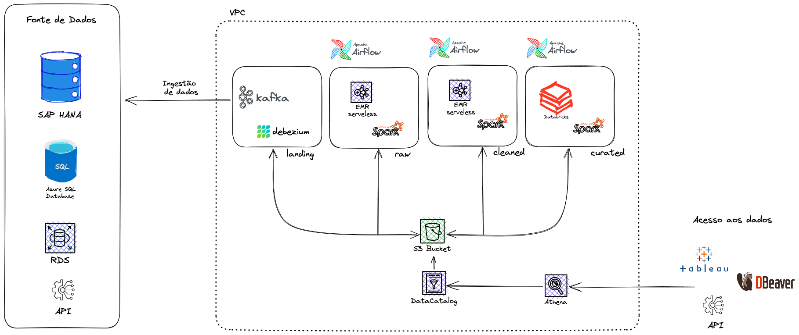

# Case Grupo Boticário

Este repositório contém os arquivos referentes ao case para o processo seletivo do Grupo Boticário pleiteando a vaga de Data Engineer.

---

### Instruções para execução

Para a execução deste projeto, é necessário ter instalado em ambiente local o docker. [Este tutorial](https://www.digitalocean.com/community/tutorials/how-to-install-and-use-docker-on-ubuntu-20-04-pt) da DigitalOcean possui o passo a passo para instalação

Com o docker instalado, agora basta executar o comando:

```bash
docker-compose up -d 
```

A partir de agora você terá a imagem Airflow disponível no caminho [http://localhost:8080/](http://localhost:8080/dags/first_load_tables/graph)

Caso não queira utilizar a porta 8080, basta alterar no arquivo docker-compose.yaml

Para login no airflow utilize as credenciais:

- user: bn_airflow
- password: bitnami1

---

A imagem abaixo compõe a arquitetura pedida no Case 1:

